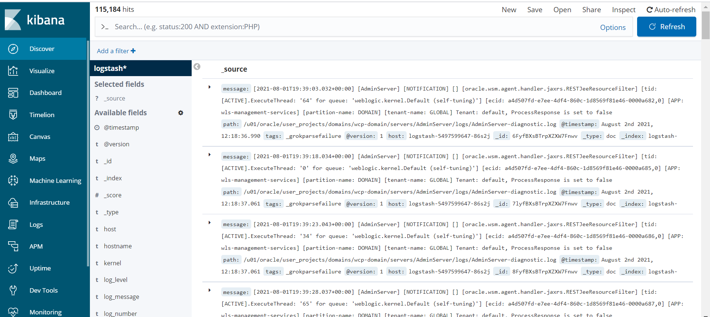

#### Install Elasticsearch and Kibana

To install Elasticsearch and Kibana, run the following command:

  ```bash
  $ cd ${WORKDIR}/elasticsearch-and-kibana
  $ kubectl create -f elasticsearch_and_kibana.yaml
  ```

#### Publish to Elasticsearch

The diagnostics or other logs can be pushed to Elasticsearch server using logstash pod. The logstash pod should have access to the shared domain home or the log location. In case of the Oracle WebCenter Portal domain, the persistent volume of the domain home can be used in the logstash pod. The steps to create the logstash pod are,

1. Get domain home persistence volume claim details of the Oracle WebCenter Portal domain. The following command will list the persistent volume claim details in the namespace - `wcpns`. In the example below the persistent volume claim is `wcp-domain-domain-pvc`.

    ```bash
    $ kubectl get pv -n wcpns
      NAME                   CAPACITY   ACCESS MODES   RECLAIM POLICY   STATUS   CLAIM                         STORAGECLASS                      REASON   AGE
      wcp-domain-domain-pv   10Gi       RWX            Retain           Bound    wcpns/wcp-domain-domain-pvc   wcp-domain-domain-storage-class            175d
    ```  

1. Create logstash configuration file `logstash.conf`. Below is a sample Logstash configuration file is located at `${WORKDIR}/logging-services/logstash`. Below configuration pushes diagnostic and all domains logs.

   ```bash
   input {                                                                                                                
     file {
       path => "/u01/oracle/user_projects/domains/wcp-domain/servers/**/logs/*-diagnostic.log"
       start_position => beginning
     }
     file {
       path => "/u01/oracle/user_projects/domains/logs/wcp-domain/*.log"
       start_position => beginning
     }
   }
   
   filter {                                                                                                               
     grok {                                                                                                               
       match => [ "message", "<%{DATA:log_timestamp}> <%{WORD:log_level}> <%{WORD:thread}> <%{HOSTNAME:hostname}> <%{HOSTNAME:servername}> <%{DATA:timer}> <<%{DATA:kernel}>> <> <%{DATA:uuid}> <%{NUMBER:timestamp}> <%{DATA:misc}> <%{DATA:log_number}> <%{DATA:log_message}>" ]                                                                                        
     }                                                                                                                    
   }                                                                                                                         
   output {                                                                                                               
     elasticsearch {                                                                                                      
       hosts => ["elasticsearch.default.svc.cluster.local:9200"]
     }                                                                                                                    
   }
   
   ```

1. Copy the `logstash.conf` into say `/u01/oracle/user_projects/domains` so that it can be used for logstash deployment, using Administration Server pod ( For example `wcp-domain-adminserver` pod in namespace `wcpns`):
  
   ```bash
    $ kubectl cp ${WORKDIR}/logging-services/logstash/logstash.conf wcpns/wcp-domain-adminserver:/u01/oracle/user_projects/domains -n wcpns 
    ```


1. Create deployment YAML `logstash.yaml` for logstash pod using the domain home persistence volume claim. Make sure to point the logstash configuration file to correct location ( For example: we copied logstash.conf to /u01/oracle/user_projects/domains/logstash.conf) and also correct domain home persistence volume claim. Sample Logstash deployment is located at `kubernetes/samples/scripts/create-wcp-domain/utils/logstash/logstash.yaml`:


    ```
    apiVersion: apps/v1
    kind: Deployment
    metadata:
      name: logstash
      namespace: wcpns
    spec:
      selector:
        matchLabels:
          app: logstash
      template: 
        metadata:
          labels:
            app: logstash
        spec:
          volumes:
          - name: domain-storage-volume
            persistentVolumeClaim:
              claimName: wcp-domain-domain-pvc
          - name: shared-logs
            emptyDir: {}
          containers:
          - name: logstash
            image: logstash:6.6.0
            command: ["/bin/sh"]
            args: ["/usr/share/logstash/bin/logstash", "-f", "/u01/oracle/user_projects/domains/logstash.conf"]
            imagePullPolicy: IfNotPresent
            volumeMounts:
            - mountPath: /u01/oracle/user_projects/domains
              name: domain-storage-volume
            - name: shared-logs
              mountPath: /shared-logs
            ports:
            - containerPort: 5044
              name: logstash
    ```


       

1. Deploy logstash to start publish logs to Elasticsearch
   
    ```bash
       $ kubectl create -f  ${WORKDIR}/logging-services/logstash/logstash.yaml
    ```

#### Create an Index Pattern in Kibana  
Create an index pattern `logstash*` in **Kibana > Management**. After the servers are started, you will see the log data in the Kibana dashboard:

